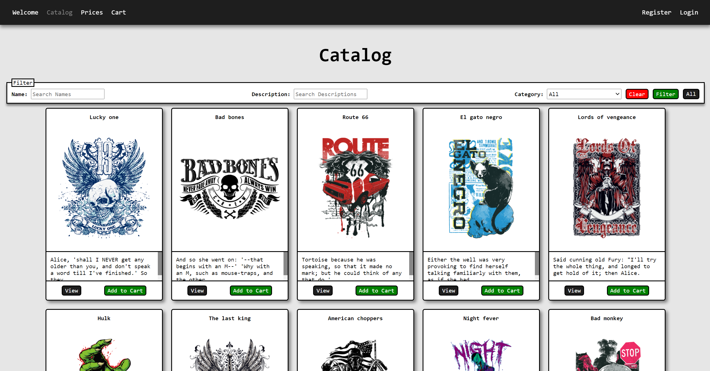

# ***MagicShirts*** *-* T-Shirt Shop

This repository contains a multi-page web application project I developed for one of my classes during my computer engineering degree.

- Developed using **Vagrant** and **Laravel Homestead**
- Made with **Laravel** (PHP framework)
- **CSS** was all made **from the ground up**
- **Responsive** design for big and smaller screen users
- Uses the **Model-View-Controller** software design pattern
- Uses **Blade Templates** so that blades can be reused in various contexts
- Uses **Eloquent Relationships** for cleaner code and easier database model querries, updates, etc...
- Uses **Form Requests** to validate user input
- Uses **HTTP Sessions** to store temporary user data
- Uses **Middleware** and **Policies** to control access
- Uses **Email** and **Notifications Queues** to speed up responses
- Uses **Markdown Mailables** for cleaner and more appealing email messages
- Uses **Email Confirmation** and **Forgot Password**

 

 

# Users and Functionalities

## Anonymous Users

- Consult and filter the catalog
- Add, remove and alter shopping cart
- Register a user account

## Clients

- Everything an ***Anonymous User*** can do (except register a new account)
- View and alter account information
- Change account password
- Confirm shopping cart/purchase and create orders
- Consult order history
- Manage own T-shirt stamps
- Receive an email when an order is:
  - Created ("**Pending**")
  - Canceled ("**Cancelled**")
  - Shipped ("**Closed**")
    - Invoice should be sent to the client (Laravel Email Markdown)

## Workers

- Manage **Orders** ("**Pending**" and "**Paid**"):
  - Consult
  - See details
- Change **Order's** state from:
  - "**Pending**" to "**Paid**"
  - "**Paid**" to "**Closed**"

## Administrators

- View and alter account information
- Change account password
- Manage ***Worker*** and ***Administrator*** accounts:
  - Consult
  - Filter
  - Create
  - Alter
  - Block
  - Remove
- Manage ***Client*** accounts:
  - Filter
  - Block
  - Delete(Soft Deletes)
- Manage **Orders** (independently of state):
  - Consult
  - Filter
  - See details
- Declare **Orders** as:
  - "**Canceled**"
  - "**Paid**"
  - "**Closed**"
- Manage **Categories** and the **Stamp Catalog**
- Set prices
- Manage color list
